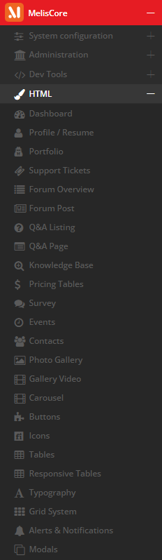
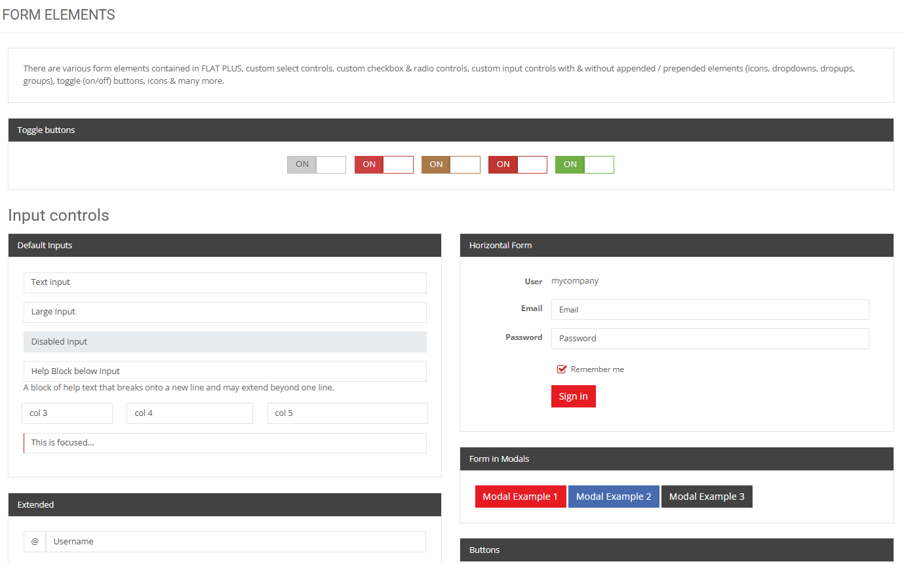
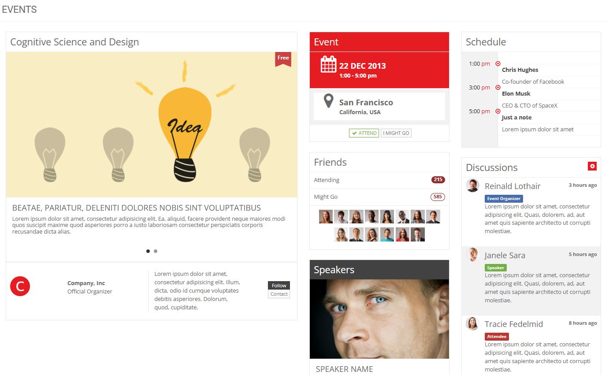

# MelisDesign — AI & developer guide

> **Module:** `melisplatform/melis-design` · **Namespace:** `MelisDesign` · type `melisplatform-module`
> **What it is:** a **back-office design catalog / pattern library**. It ships ~60 ready-made HTML/JS screens
> and UI components built on the **MelisCore admin theme**, so a developer can browse a pattern, copy its HTML
> (and JS), and drop it into their own tool or plugin instead of designing from scratch. README, verbatim:
> *“provides a complete set of designs and web interfaces … to help developers focus on business logic while
> having ready-to-use designs.”* It has **no database, no services, no business logic** — it is pure
> view + asset reference. Screenshots will be added later.

---

## 0. What this module is (and is not)

- **It is** the *style guide / component gallery* of the platform: every demo page is a controller that simply
  renders a `.phtml`, showing how a given screen or widget looks with MelisCore’s CSS already applied.
- **It is not** a functional feature — none of the demos (Medical, Shop, Support, Maps, …) are wired to real
  data. They are **templates to copy**, not tools to use.
- **The promise (from the README):** *“All styles are already included with MelisCore. There is no need to look
  for CSS. Just find the HTML and JS if needed and start coding a plugin!”*

It depends only on **`melisplatform/melis-core`** (`^5.2`) for the theme/assets (the README also expects
`melis-cms` to be present). The designs are meant to be reused when you build tools for
[`MelisCore`](../../../melis-core/etc/MelisAI/doc/MelisCore.md) or CMS plugins.

**Mental model:** *open the **Designs** tool → find the screen/component you need → open its `.phtml` under
`view/melis-design/<area>/` (and JS under `public/js/<area>/`) → paste it into your own view → wire your logic.
No CSS hunting — the look comes from MelisCore.*

---

# PART A — Functional guide

## A1. Browsing the catalog

In the back office, open the tool under **MelisCore** — it appears in the left menu as **HTML** (the tool’s
melisKey is `meliscore_tool_creatrion_designs`). That **HTML** sub-menu lists every demo page; clicking one
renders that design full-screen so you can see the component live. There is nothing to configure or save — it
is a read-only showcase.



The designs are built on MelisCore’s admin theme (the demos refer to it as **“FLAT PLUS”**) — which is why you
copy only the markup, never the CSS.

## A2. The catalog (what’s in the box)

The ~60 demos, grouped:

| Group | Designs |
|---|---|
| **App shells & profiles** | Dashboard · Profile / Resume · Portfolio · Edit Account · Social · Ratings |
| **Support / community** | Support Tickets · Forum Overview · Forum Post · Q&A Listing · Q&A Page · Knowledge Base · Survey |
| **Commerce & finance** | Pricing Tables · Finances · Invoice · Bookings · Add Product · Products |
| **Medical (vertical demo)** | Medical Overview · Patients · Appointments · Memos · Metrics |
| **Maps** | Google Maps · Clustering · Extend · Filter · Search · JSON · Vector Maps |
| **Media & galleries** | Photo Gallery · Gallery Video · Carousel · Sliders |
| **Data & layout** | Tables · Responsive Tables · Grid System · Charts · Calendar · Events · Contacts · Timelines · Widgets |
| **UI elements** | Buttons · Icons · Typography · Alerts & Notifications · Modals · Tabs |
| **Forms** | Form Wizards · Form Elements · Form Validator |
| **Files & messaging** | File Manager · Inbox |
| **Auth & errors** | Login · Signup · Error |

Two representative demos — a **components** page (Form Elements) and a **composite layout** (Events):



*Form Elements* is a **component sheet**: toggle on/off buttons, default/large/disabled inputs, a horizontal
form, form-in-modals and prepended-icon inputs — copy whichever block you need.



*Events* is a **full-page layout**: a hero, an event card, a schedule, speakers and a discussions feed — a
starting point for a whole screen rather than a single widget.

## A3. How do I…?

- **…build a back-office tool that looks native?** Find the closest design (e.g. *Dashboard*, *Tables*,
  *Form Elements*) in the Designs tool, copy its `.phtml` from `view/melis-design/<area>/` into your module’s
  view, and replace the demo data with yours.
- **…find the matching JavaScript?** It’s under `public/js/<area>/` (e.g. charts, maps). The CSS you do **not**
  need to copy — it already loads with MelisCore.
- **…know which area maps to which design?** The folder name mirrors the design name (e.g. *Buttons* →
  `view/melis-design/buttons-icons/`, *Form Validator* → `form-validator/`). See §B2.

---

# PART B — Technical reference

## B1. How it’s wired

- **One controller per design**, each a thin `AbstractActionController` whose single `render…Action()` returns
  a `ViewModel` (it just passes the `melisKey` through). Example — `ButtonsIconsController`:

  ```php
  public function renderButtonsIconsAction() {
      $melisKey = $this->params()->fromRoute('melisKey', '');
      $view = new ViewModel();
      $view->melisKey = $melisKey;
      return $view;            // → view/melis-design/buttons-icons/…phtml
  }
  ```

- **Routing** (`config/module.config.php`): a generic child route
  `/MelisDesign/[:controller[/:action]]` dispatches to any of the design controllers.
- **The tool & sidebar** (`config/app.interface.php`): the **Designs** tool under
  `meliscore_leftmenu → meliscore_toolstree_section` (`meliscore_tool_creatrion_designs`), and a sub-interface
  `melisdesign_cof` (**HTML**) enumerating all ~60 pages, each with a `forward` to its controller.
- **`DesignSidebarController`** renders the left navigation and exposes two AJAX helpers:
  `getDomAction()` (returns the sidebar DOM via `MelisCoreTool::getViewContent`) and `getResourceAction()`
  (returns a design’s resource config read from `melisdesign/datas/<key>` in `MelisCoreConfig`).

## B2. Where the code lives

```
src/Controller/<Name>Controller.php   ← one per design, single render…Action()
view/melis-design/<area>/             ← the HTML you copy (folder name ≈ design name)
public/js/<area>/                     ← optional JS for that design (charts, maps, wizards…)
config/app.interface.php              ← the Designs tool + the full page list (left "HTML" menu)
config/module.config.php              ← generic /MelisDesign/[:controller[/:action]] route + controllers
```

There are **no** `Model/`, `Service/`, or `Table` classes — by design. Nothing here persists or computes; it is
a catalog of front-end templates.

## B3. Using a design in your own module (the intended workflow)

1. Browse **Designs** in the BO and pick the screen/component.
2. Copy the corresponding `view/melis-design/<area>/*.phtml` markup into your tool’s view.
3. If it needs behaviour, grab the matching `public/js/<area>/*` and include it from your module.
4. **Skip the CSS** — MelisCore already provides the classes; just reuse the same markup structure.
5. Replace the demo content with your real data/bindings.

> **Note for reviewers / AI:** treat MelisDesign as **scaffolding/reference only**. The vertical demos
> (Medical, Shop, Support, Maps variants) exist to show layouts; they are not features and should not be linked
> to production data. When in doubt, the design’s `.phtml` is the source of truth for the markup.

---

## Screenshot index

| File | Shows |
|---|---|
| `images/melisdesign-menu-html-entries.png` | The **HTML** (Designs) sub-menu under MelisCore, enumerating the demo pages. |
| `images/melisdesign-design-formelements.png` | The **Form Elements** demo — a component sheet (toggles, inputs, horizontal form, form-in-modals). |
| `images/melisdesign-design-events.png` | The **Events** demo — a composite full-page layout (hero, event card, schedule, speakers, discussions). |

*The promo images under `etc/MarketPlace/` are kept separate and are not referenced by this doc. Other demo
pages are not individually captured — add more under `./images/` and extend this index if useful.*
